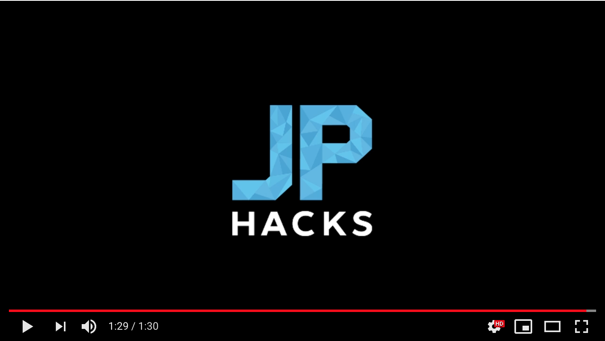

#### お薬飲んでねbot

#### 製品概要
Medicine Tech

#### 背景
日常的に薬を服用している人は、薬の服用を忘れてしまうことがある。
全日本民医連によると、薬の飲み忘れは、医師が誤って薬の量を増やしてしまうなどの危険がある。
そこで、我々は薬の飲み忘れを防止するアプリケーションを開発しようと考えた。
既存で薬の時間をリマインドするアプリケーションは存在していたが、普段から使うLINEと組み合わせることでさらに良いものになると我々は考えた。

#### 製品説明
基本的にClovaと我々の作成したbotをセットで使用する。
家にいるときは、Clovaを使い薬の時間であることをお知らせする。
外出中は

こちらに製品の概要・特徴について説明を記載してください
特長

#### 1. 特長1

#### 2. 特長2

#### 3. 特長3

### 解決出来ること
この製品を利用することによって最終的に解決できることについて記載をしてください。
人混みの中で、直接コミュニケーションを必要とせず好みの人と繋がることができる。

### 今後の展望
今回は実現できなかったが、今後改善すること、どのように展開していくことが可能かについて記載をしてください。

## 開発内容・開発技術
### 活用した技術
#### API・データ
今回スポンサーから提供されたAPI、製品などの外部技術があれば記述をして下さい。

* 
* 
* 

#### フレームワーク・ライブラリ・モジュール
* 
* 

#### デバイス
* 
* 

### 研究内容・事前開発プロダクト（任意）
ご自身やチームの研究内容や、事前に持ち込みをしたプロダクトがある場合は、こちらに実績なども含め記載をして下さい。

* 
* 

### 独自開発技術（Hack Dayで開発したもの）
#### 2日間に開発した独自の機能・技術
* 独自で開発したものの内容をこちらに記載してください
* 特に力を入れた部分をファイルリンク、またはcommit_idを記載してください（任意）
